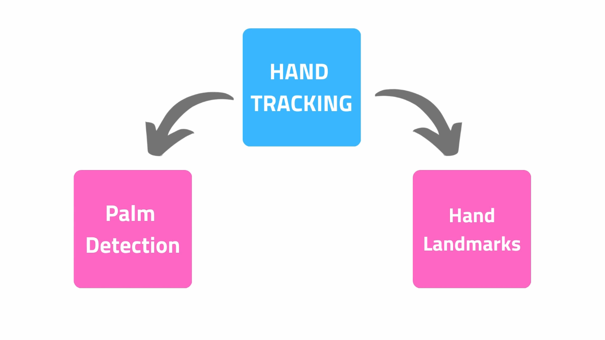
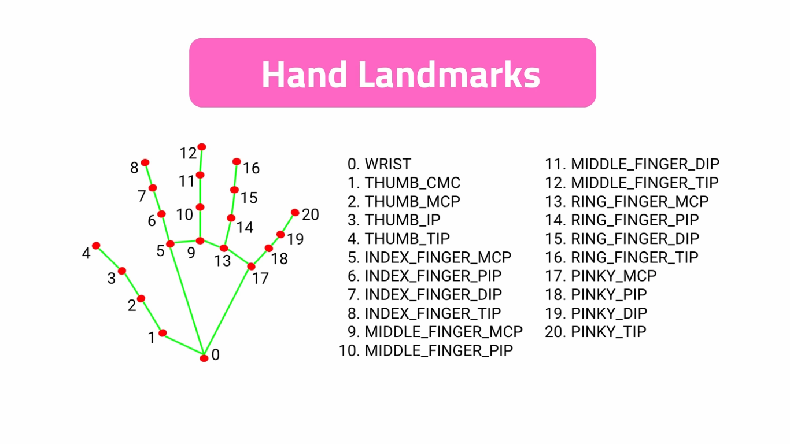

# Hand Tracking Project

This Python3 project show you how to use Mediapipe library to track hands information. Specifically the modules for `Palm Detection` and `Hand Landmarks` to process images in the backend.



## Dependencies

We will use the next two major dependencies:
* OpenCV 2
* Mediapipe

To install them, run the next command inside your virtual environment:
```bash
pip3 install -r requirements.txt
```

## Dots of the Hand

Mediapipe use the next model to track the dots of our hands:



## Run and Test the Project

To run the project and test it, execute the next command:
```bash
python3 HandTracking.py
```

To stop the execution, please use the key combination `Ctrl+C` if you are running the project from terminal or if you are executing the project from an IDE, simply press the STOP button.
